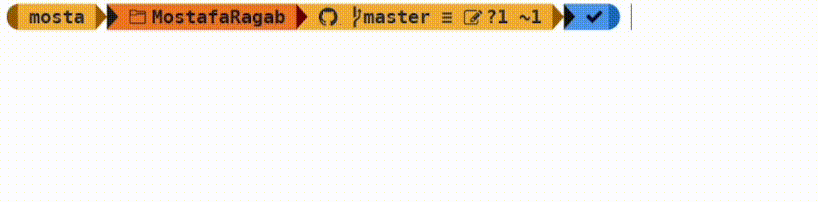

##  Hi, 您好, هلا والله

[](https://visitcount.itsvg.in)

### About me.. ☺️

```javascript
script.js;

class Developer {
  constructor(
    name,
    pastJob,
    currentJob,
    programmingLanguages,
    frontendTechnologies,
    backendTechnologies
  ) {
    this.name = name;
    this.pastJob = pastJob;
    this.currentJob = currentJob;
    this.programmingLanguages = programmingLanguages;
    this.frontendTechnologies = frontendTechnologies;
    this.backendTechnologies = backendTechnologies;
  }

  displayInfo() {
    console.log(
      `Hi, I'm ${this.name}, and I used to work as a ${
        this.pastJob
      }. Currently, I'm a ${
        this.currentJob
      }, working with frontend technologies like ${this.frontendTechnologies.join(
        ", "
      )}, backend technologies such as ${this.backendTechnologies.join(
        ", "
      )}, and write code in programming languages like ${this.programmingLanguages.join(
        ", "
      )}.`
    );
  }
}

let whoAmI = new Developer(
  "Mostafa",
  "Chemist",
  "Full Stack Developer In Training",
  ["JavaScript", "Python"],
  ["HTML", "CSS", "Bootstrap", "jQuery", "React"],
  ["Node.js", "Express.js", "MongoDB"]
);

whoAmI.displayInfo();
```



##

<br>


<br>

- 🧑🏻‍💻 I’m currently Learning **Node.js**.

- 🔍 Connect with me on [**Linkedin**](https://www.linkedin.com/in/imostafarh/).

- 📨 Contact me: **imostaf.ragab@gmail.com**.

<br>
<br>

<p align="left">
  
  
  
  
  
  
  
    
    
  
  
</p>

##


