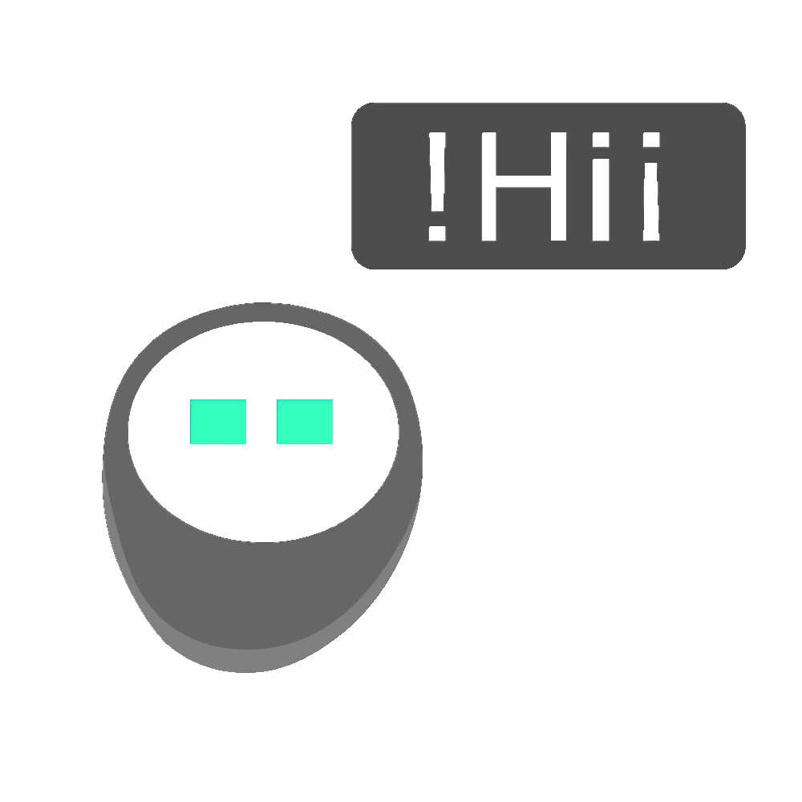

##  Hi, Hola, 您好, هلا والله

### About me.. ☺️


```javascript
class Developer {
  constructor(name, job, technology, lib) {
    this.name = name;
    this.job = job;
    this.technology = technology;
    this.lib = lib;
  }
  displayInfo() {
    console.log(
      `Hi, I'm ${this.name}, a ${this.job.inPresent} 
      building web apps with ${this.technology.join(", ")}, 
      ${this.lib.join(", ")}.`
    );
  }
}

let whoAmI = new Developer(
  "Mostafa",
  {
    inPast: "Chemist",
    inPresent: "Front-End Developer",
  },
  ["HTML", "CSS", "JavaScript"],
  ["BootStrap", "jQuery", "React"]
);

whoAmI.displayInfo();
```

##

<br>


<br>

- 🧑🏻‍💻 I’m currently Learning **React**.

- 🔍 Connect with me on [**Linkedin**](https://www.linkedin.com/in/imostafarh/).

- 📨 Contact me: **imostaf.ragab@gmail.com**.

<br>
<br>

<p align="left">
  
  
  
  
  
  
    
  
  
</p>
